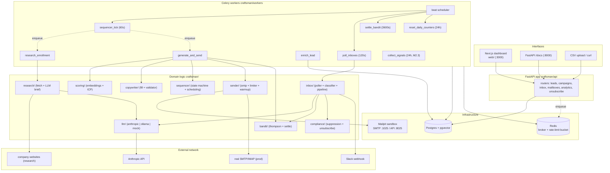

# Craftsman (OpenSDR) — Complete Application Overview & Enterprise-Refinement Brief

> **Purpose of this document.** A single, top-down, source-verified map of the entire
> application, written so a second engineer (or a fresh Claude session) can understand
> everything at once and drive it to enterprise grade. Every structural claim is grounded
> in the code at `file:line`. Where something is a *suspected* issue that needs a runtime
> test rather than a code fact, it is marked **[needs runtime check]**.
>
> **Current state (as verified 2026-07):** functional alpha. `59` automated tests pass
> (README says 54 — stale). The core learning loop, anti-hallucination gate, state machine,
> compliance headers, and dashboard all work. It is **not** production/enterprise ready —
> see §11. The README itself says: *"alpha stage, no real inboxes were sent, commands are mocked."*

---

## 1. What it is (one screen)

Craftsman is an **open-source AI SDR** (sales development rep): you load leads, it researches
each company, writes personalized cold-email sequences under a strict anti-hallucination gate,
sends them inside the lead's business hours, classifies replies, hands interested humans off to
a person, and **learns which copy works** via a Thompson-sampling bandit over copy variants.

The thesis (from the README): a commercial "AI SDR employee" is mechanically *a state machine +
a scraper + two constrained LLM calls + SMTP plumbing + a contextual bandit*. This repo is the
honest, inspectable version. Two design commitments define it:

1. **The LLM never free-writes an email.** It fills four typed slots in a fixed skeleton, from a
   structured research brief, and a deterministic validator rejects any fill whose proper
   nouns/numbers aren't grounded in the brief. (§6.5)
2. **It never auto-replies to a human.** Inbound replies only ever change state, update the
   bandit, suppress, or ping Slack — no code path composes a reply back. (§6.8, verified)

**Stack:** FastAPI + Postgres/pgvector + Celery/Redis + a Next.js dashboard, all via
`docker compose up`. LLM is provider-agnostic (Anthropic default, Ollama fallback, mock for tests).

---

## 2. System architecture



**Key architectural fact:** the pipeline is **asynchronous and DB-driven**, not a synchronous
request chain. A lead cannot go "CSV → sent email" in one call. It flows through three Celery
task boundaries plus an operator action (`activate`) plus a 60-second beat tick. State lives in
Postgres; workers are stateless; the only cross-worker coordination is Postgres row locks
(`SELECT ... FOR UPDATE SKIP LOCKED`) and a Redis token bucket for send spacing.

---

## 3. The per-lead pipeline (end to end)

Ordered, with the real function names and file:line. This is the spine of the whole product.

| # | Stage | Trigger | Code | Result |
|---|---|---|---|---|
| 1 | **Ingest** | `POST /leads/import` | `import_csv` (`ingest/csv_import.py:35`) | Leads created (`status="new"`), deduped vs existing + suppression list, syntax-gated |
| 2 | **Verify email** | Celery `enrich_lead` | `verify_email` (`ingest/verify.py:47`) | syntax → MX → optional SMTP RCPT; sets `email_verified`, `status="verified"` |
| 3 | **Campaign activate** | `POST /campaigns/{id}/activate` (operator) | `activate` (`api/routers/campaigns.py:74`) | Verified leads ICP-scored; sub-threshold → `disqualified`; else `Enrollment(state="queued")` |
| 4 | **Tick picks up work** | beat every 60s → `sequencer_tick` | `tick` (`sequencer/tick.py:59`) | `queued`→enqueue research; `ready`/`waiting`(timer)→enqueue send |
| 5 | **Research** | Celery `research_enrollment` | `research_company` (`research/agent.py:25`) | Fetches company pages → one structured LLM brief → cached 30d on `companies.research_brief`; state→`ready` |
| 6 | **Embed + ICP score** | during activate (step 3) | `scoring/icp.py`, `scoring/embeddings.py` | `icp_score` = `0.7*cosine + 0.3*rule_score` |
| 7 | **Pick variant** | inside `generate_and_send` | `pick_arm` (`bandit/thompson.py:34`) | Thompson-samples each active variant's Beta posterior; argmax |
| 8 | **Fill copy** | inside `generate_and_send` | `generate_copy` (`copywriter/fill.py:84`) | One LLM call fills 4 slots; rendered into skeleton |
| 9 | **Validate (the gate)** | inside fill | `validate_fill` (`copywriter/validator.py:98`) | 4 gates; fail→retry once with errors→2nd fail→`ReviewQueueItem`, state→`error`, **no send** |
| 10 | **Pre-send checks** | inside `generate_and_send` | `run_presend_checks` (`sender/smtp.py:71`) | suppression → campaign cap → mailbox cap (warmup-adjusted) → Redis rate slot |
| 11 | **Build + send** | inside `generate_and_send` | `build_email`→`deliver` (`sender/smtp.py:85,117`) | Plain-text email w/ compliance+threading headers → `aiosmtplib.send` (the one wire-send) |
| 12 | **Record + schedule next** | after send | `tasks.py:170-188` | Outbound `Message(bandit_outcome="pending", outcome_deadline)`; state→`waiting`; schedule next step |
| 13 | **Poll replies** | beat every 120s → `poll_inboxes` | `fetch_unseen`/`fetch_mailpit` (`inbox/poller.py`) | Matches inbound to a thread we own |
| 14 | **Classify** | inside `handle_inbound` | `classify_reply` (`inbox/classifier.py:29`) | One enum-constrained LLM call → label + confidence |
| 15 | **Apply** | inside pipeline | `apply_classification` (`inbox/pipeline.py:89`) | State transition + bandit update + suppress/Slack. conf<0.7 → review queue |
| 16 | **Settle bandit** | beat hourly → `settle_bandit` | `settle_expired` (`bandit/settle.py`) | Pending messages past `outcome_deadline` with no reply → `beta += 1` (failure) |
| 17 | **Daily reset** | beat daily → `reset_daily_counters` | `tasks.py:253` | `sent_today=0`, bounce counters reset, degraded→ok, warmup stage +1 |

---

## 4. Data model

SQLAlchemy models in `craftsman/core/models.py`. Schema is applied by **Alembic migrations**
(`craftsman/migrations/`) — the API runs `run_migrations()` (`alembic upgrade head`) on startup
(`api/app.py`). `Base.metadata.create_all` via `init_db()` survives only as the fast dev/test/demo
path (used by tests and the seed scripts). *(M0.2)*

| Table | Key fields | Notes |
|---|---|---|
| **companies** | `domain` (unique), `name`, `industry`/`size`/`description` (enrichment-fillable, M2.1), `research_brief` (JSONB), `research_fetched_at`, `embedding` Vector(1024) | Research cached here, 30d TTL |
| **leads** | `email` (unique), `company_id` FK, name/title/linkedin + `seniority`/`phone` (enrichment-fillable, M2.1), `timezone` (default `America/Los_Angeles`), `email_verified`, `icp_score` + provenance (`icp_cosine`, `icp_rule`, `icp_scored_campaign_id` FK, `icp_scored_at`), `status` (new/verified/disqualified/suppressed), `source` | The canonical PII row. Score is per-*last-activation*: provenance records which campaign and when (M1.3, `migrations/0006`) |
| **lead_enrichments** | `lead_id` FK (no cascade — M0.4 doctrine), `field`, `value`, `source`, `confidence`, `fetched_at` | Append-only enrichment provenance (M2.1, `migrations/0008`): who said what, even when the CSV value won. PII — deleted by `erase_lead` |
| **signals** | `company_id` FK, `type` (funding/leadership_hire/job_posting/tech_stack_change), `payload` JSONB, `observed_at`, `source` | Company-level intent observations (M2.3, `migrations/0009`). NOT person PII → untouched by erasure. Feeds the decaying signal score component |
| **signal_rules** | `campaign_id` FK, `signal_type`, `action` (boost_score/enroll/notify), `active` | Per-campaign policy (M2.3). `enroll` is the only autonomy-bearing action; off until an operator creates it |
| **collector_state** | `company_id` FK, `collector`, `fingerprint`, `updated_at` | Per-company diff baseline so collectors detect *change* / dedupe feed entries (M2.3) |
| **campaigns** | `name`, `icp_description`, `value_prop`, `sender_persona` (JSONB), `daily_cap` (50), `status` (draft/active/paused/done), `icp_embedding` Vector(1024) | |
| **sequence_steps** | `campaign_id` FK, `step_order` (1=opener,2=bump,3=breakup), `wait_days` (3); unique(campaign,step_order) | Drip structure |
| **variants** | `step_id` FK, `name` (pain_led/trigger_led/question_led), `skeleton`, `slot_schema` (JSONB), `alpha`/`beta` (Beta prior 1/1), `active` | **Each variant = a bandit arm** |
| **enrollments** | `lead_id`+`campaign_id` (unique), `state`, `current_step`, `next_action_at`; partial index on due states | One lead's journey through one campaign |
| **messages** | `enrollment_id` FK, `variant_id` FK, `direction` (outbound/inbound), `mailbox_id`, subject/body, `smtp_message_id`, `classification`(+confidence), `bandit_outcome` (pending/success/failure), `outcome_deadline`, `sent_at` | Holds **reply content + email PII** |
| **mailboxes** | `email` (unique), SMTP/IMAP host/port/user, `smtp_pass_enc`/`imap_pass_enc` (Fernet-encrypted), `dkim_selector` (optional, M1.4), `daily_limit` (40), `sent_today`, `warmup_stage` (0..4), `health` (ok/degraded/paused), `hard_bounces_today` | Sending identities |
| **suppression_list** | `email` (PK), `reason` (unsubscribe/bounce/manual/gdpr), `created_at` | Permanent do-not-contact |
| **audit_log** | `enrollment_id`, from/to state, event, detail (JSONB) | Every state transition |
| **review_queue** | `kind` (classification/copywriter), `message_id`/`enrollment_id`, `payload` (JSONB), `resolved` | Human-in-the-loop items |
| **unsubscribe_tokens** | `token` (PK), `lead_email`, `created_at` | One-click unsubscribe |

**Relationship spine:** Company 1─* Lead 1─* Enrollment *─1 Campaign 1─* SequenceStep 1─* Variant.
Message *─1 Enrollment and *─1 Variant (this is how a reply is attributed to the arm that earned it).

> **Note (M0.4):** no child FK declares `ON DELETE CASCADE` — deliberately kept that way. Only the
> GDPR path (`erase_lead`) performs ordered multi-table deletion; the FK constraints keep protecting
> every other code path from accidental lead deletion. See §11-C2 (resolved).

---

## 5. LLM abstraction (`craftsman/llm/`)

- `client.py` — `LLMClient` protocol with `.structured(system, user, schema, ...)` returning a
  validated Pydantic object. `get_llm()` picks the impl from `LLM_PROVIDER` (anthropic/ollama/mock).
- `anthropic_impl.py` — official `anthropic` SDK, model default `claude-sonnet-4-6`, `MAX_RETRIES=2`.
- `ollama_impl.py` — local Ollama `/api/chat`, default `qwen2.5:14b`, 120s timeout.
- `mock_impl.py` — deterministic canned structured outputs; **this is what the test suite uses** (no
  API key, no network).

Every LLM interaction in the app is **structured output only** (a schema is always passed): the
research brief (`ResearchBrief`), the copy slots (`SlotFill`), and the reply label
(`ReplyClassification`). There is no free-text generation anywhere. Schemas live in `core/schemas.py`.

---

## 6. Core subsystems (module by module)

### 6.1 Ingest & verification (`craftsman/ingest/`)
- `gate.py` — **the one import gate** (M2.2): `classify_row` (pure `new|duplicate|suppressed|invalid`
  predicate) + `ingest_leads(rows, source) -> (ImportResult, new_ids)`. Syntax → suppression → dedupe
  (in-batch + vs existing) → get-or-create Company → persist. CSV upload and provider sourcing both
  route through it — sourced leads get zero shortcuts.
- `csv_import.py` — CSV-specific concern only: parse + column-alias normalize (`rows_from_csv`) →
  `LeadRow`s → the shared gate. Returns `ImportResult`.
- `sourcing.py` — **lead sourcing connectors** (M2.2): `LeadSourceProvider.search(query) -> LeadRow[]`
  protocol; `ApolloSourceProvider` (`mixed_people/search`, BYO key — credit-locked/placeholder emails
  are dropped, never faked or credit-unlocked silently), `WebhookSourceProvider` (GET a configured
  https feed **through the M0.5 SSRF guard**, JSON or CSV body), `NullSourceProvider`. Each provider
  has one monkeypatchable `_fetch` seam. `build_source_provider`/`enabled_providers` gate on
  `LEAD_SOURCE_PROVIDERS` + key presence.
- `verify.py` — `syntax_ok` → `mx_hosts` (dnspython MX) → optional `smtp_rcpt_ok` (SMTP RCPT probe
  on port 25, only if `do_rcpt=True`). This is the "syntax → MX → SMTP" verification the README claims.
- `enrichment.py` — the BYO-key enrichment framework (M2.1; the former orphaned `adapters.py`
  promoted into the pipeline). `EnrichmentProvider.enrich(input) -> EnrichmentResult` protocol;
  Apollo + Hunter + null implementations, each with a single monkeypatchable `_fetch` network seam.
  `chain_enrich` runs providers in `ENRICHMENT_PROVIDERS` order with per-field first-writer-wins and
  per-provider failure isolation (a dead provider is logged + skipped, never raised).
  `apply_enrichment` records provenance for every winning field, then fills **only empty** canonical
  columns — operator CSV data is never overwritten. `enrich_lead` (workers) runs verify → enrich;
  enrichment failures never cost a lead its verification, and unverified leads are never enriched
  (no provider spend on dead addresses). Empty `ENRICHMENT_PROVIDERS` ⇒ verify-only.

### 6.2 Research agent (`craftsman/research/`)
- `fetch.py` — `httpx` GETs `https://{domain}` + `/about`, `/about-us`, `/company`; strips HTML via
  selectolax; caps at `MAX_CHARS=24_000`; skips pages under 200 cleaned chars; 15s timeout.
  **SSRF-guarded (M0.5):** `validate_url` enforces https-only + port 443 and rejects any host that
  resolves to a private/loopback/link-local/CGNAT/reserved IP; redirects are followed manually and
  re-validated per hop (≤3). Unsafe URLs are skipped, not fetched.
- `agent.py` — `research_company`: if brief fresh (<30d) return cached; else fetch → one structured
  LLM call (`RESEARCH_SYSTEM`) → `ResearchBrief` cached on the company row. Raises `ResearchError`
  if no fetchable sources.
- `prompts.py` — the grounded research prompt.
- **`ResearchBrief`** = `{what_they_do, industry, trigger_events[], likely_pain_points[≤3], evidence_quotes[]}`.
  This brief is the *only* source of facts the copywriter is allowed to use.

### 6.3 Scoring (`craftsman/scoring/`)
- `embeddings.py` — pluggable embedder; default `hash` (deterministic, offline), optional Voyage API.
  Dim 1024.
- `icp.py` — two-mode blend (M2.3). No-signal leads: `0.7·cosine + 0.3·rule_score` (unchanged).
  Leads whose company has ≥1 signal: `0.6·cosine + 0.25·rule + 0.15·signal_boost`. The `None`
  signal sentinel selects the 2-way path, so configuring signals never changes the score of a
  lead that has none (the ⛔ Gate M2 'renormalized' decision). Weights are config knobs.
  rule_score is seniority-keyword weighted (VP/Head/Director…), unknown title → 0.3 neutral.
  `icp_threshold=0.55` gates enrollment at activate time.
- `signals.py` — pure decay math: `signal_boost = clamp(Σ type_weight·0.5^(age/half_life), 0, 1)`.
- `collectors.py` — SSRF-guarded intent collectors (M2.3), each optional via `SIGNAL_COLLECTORS`:
  `HomepageDiffCollector`→tech_stack_change, `CareersDiffCollector`→job_posting (both diff a
  page fingerprint vs `collector_state`), `RssFundingCollector`→funding (RSS watch, deduped by
  link). Failure-isolated per company.
- `rules.py` — `company_signal_boost` (scoring read side) + `evaluate_rules` (write side:
  boost_score/notify/enroll). `enroll` auto-enrolls verified + above-threshold +
  not-already-enrolled leads into `queued` — identical to activate, never skipping research or
  validation.

### 6.4 Copywriter (`craftsman/copywriter/fill.py`)
- Skeleton has 4 LLM-filled slots (`subject_hook`, `personalization_sentence`, `value_prop_bridge`,
  `cta_question`) + static fills (`first_name`, `signature`).
- `generate_copy` loop: LLM fill → render → `validate_fill`. On failure, append validator errors to
  the prompt and retry **once**. Second failure → `CopyResult(ok=False)` → caller routes to review
  queue and does **not** send. `max_attempts=2`, `max_tokens=400`, `temperature=0.7`.

### 6.5 Validator — the anti-hallucination gate (`craftsman/copywriter/validator.py`)
Four deterministic gates, all must pass:
1. **Grounding** — every proper noun and number extracted from the fill must appear in the grounding
   corpus (research brief + campaign config + lead fields), via substring or `rapidfuzz.partial_ratio
   ≥ FUZZY_THRESHOLD (90.0)`.
2. **Banned phrases** — a curated list (`banned_phrases.txt`) + em/en-dash rejection.
3. **Length caps** — subject ≤ 7 words, body ≤ 90 words.
4. **Reading grade** — `textstat.flesch_kincaid_grade` ≤ 8.

This is the single structural gate between LLM text and SMTP; it is unconditionally invoked on the
one send path and on every retry (verified — there is no bypass, no admin/test-send endpoint, and the
review queue has no release-and-send route).

> **✅ Fixed (M0.3):** the bug was confirmed at runtime (`10,000` fuzzy-grounded against `1,000`)
> and closed. Grounding is now two paths: entities keep `partial_ratio ≥ 90`; **numbers take an
> exact-match path after normalization** (`normalize_numeric` in `validator.py`): currency symbols
> stripped for matching, separators stripped, magnitude suffixes expanded via `Decimal`
> (`$4M ≡ $4,000,000 ≢ $40M ≢ $4.2M`), `12%` requires a percent source. The full `TESTING.md`
> §3.1 table is a permanent regression suite (`tests/adversarial/test_validator_attacks.py`);
> residual gaps outside the numeric scope are logged in `findings/04-validator.md`.

### 6.6 Sequencer (`craftsman/sequencer/`)
- `machine.py` — pure-function state machine; the transition table is data. States:
  `queued | researching | ready | waiting | awaiting_human_touch | replied_interested |
  replied_objection | replied_not_now | ooo_rescheduled | bounced | unsubscribed |
  finished_no_reply | error`. Terminal states never re-scan. `"*"` wildcard routes
  BOUNCE/UNSUBSCRIBE from any non-terminal state. `awaiting_human_touch` (M3.1): an
  assisted-channel step queued a validated task; TASK_DONE/TASK_SKIPPED (human, via
  `/tasks`) or TASK_EXPIRED (tick, `skip_on_expire` steps only) return it to `waiting`;
  replies route from it normally — paused, not deaf.
- `scheduling.py` — `next_send_time`: earliest business-hours slot (9:00–16:30 lead-local, ±20min
  jitter, weekends skipped), returns UTC. Bad timezone → falls back to `America/Los_Angeles`.
- `tick.py` — `tick()` scans due enrollments with `FOR UPDATE SKIP LOCKED` (batch 200), applies
  timers, and calls the injected enqueue callbacks — routed per step channel (M3.1: email →
  `generate_and_send`, assisted → `generate_touch_task`). `apply_event` writes the audit log.
- `touch.py` — touch-task lifecycle (M3.1): `resolve_task` (done/skipped/expired → advances via
  the state machine + `schedule_next_step`; refuses non-open tasks so a task can never advance a
  sequence twice) and `cancel_open_tasks` (reply/bounce/unsub/suppression orphaned the task).

### 6.7 Sender & compliance (`craftsman/sender/`, `craftsman/compliance/`)
- `smtp.py` — `run_presend_checks` (suppression → campaign daily cap → mailbox pick with
  warmup-adjusted cap → Redis rate slot), `build_email` (plain-text + `List-Unsubscribe` +
  `List-Unsubscribe-Post: One-Click` + threading headers + CAN-SPAM physical-address footer),
  `deliver` (aiosmtplib, STARTTLS@587), `record_bounce` (2 hard bounces/day → `degraded` → cap halves).
- `limiter.py` — Redis token bucket, one send per mailbox per 45–90s (jittered).
- `warmup.py` — `WARMUP_CAPS = {0:10, 1:20, 2:30, 3:40}`, stage ≥4 → full `daily_limit`.
- `compliance/suppression.py` — `is_suppressed`, `suppress`, `make_unsubscribe_token`, `erase_lead`.
- `compliance/unsubscribe.py` — token processing for the `/u/{token}` endpoints.
- **GDPR mode** blocks EU-TLD enrollment — a **weak heuristic** (an EU resident on a `.com` Gmail is
  still covered by GDPR but not blocked). Should be documented as such.

### 6.8 Inbox (`craftsman/inbox/`)
- `poller.py` — IMAP (`imaplib`) UNSEEN fetch + Mailpit HTTP API fetch (sandbox); `match_thread`
  attributes an inbound to an outbound we sent.
- `reply_parser.py` — `strip_quoted` removes quoted history so the classifier sees only fresh text.
- `classifier.py` — one enum-constrained LLM call → `ReplyClassification{label, ooo_return_date?,
  confidence}`. Labels: interested/objection/not_now/ooo/unsubscribe/bounce_or_auto. `temperature=0.0`.
- `pipeline.py` — `handle_inbound`: match → strip → classify → store. `confidence < 0.7` → review
  queue (no state change). Else `apply_classification`: state transition + bandit update + side
  effects (unsubscribe→suppress; bounce→suppress+degrade mailbox; **interested→Slack webhook only**).
- **Verified guarantee:** no inbound outcome composes or sends an email. The only inbound→*eventual*
  outbound linkage is `ooo` → `ooo_rescheduled` → timer → resumes the already-queued drip on the
  return date (a deferral of existing outreach, not a reply to the inbound).

### 6.9 Bandit — the learning loop (`craftsman/bandit/`)
- `thompson.py` (~80 lines) — each variant is an arm with `Beta(alpha,beta)`. `pick_arm` samples each
  posterior and takes argmax. `update_arm`: any human reply (interested/objection/not_now) → `alpha+=1`
  (success); unsubscribe → `beta+=1` (failure); ooo/bounce → **no update** (not the copy's fault).
  `should_deactivate`: arm dies if `trials ≥ 30` and `mean < 0.5 * best_mean`. `posterior_pdf` for the
  dashboard.
- `settle.py` — `record_reply_outcome` (immediate update from a reply) and `settle_expired` (pending
  sends past deadline with no reply → failure). This is the delayed-feedback mechanism.
- `simulator.py` — runs the bandit against synthetic reply rates (0.06/0.02/0.035, seed 42, 500 sends)
  to show convergence with zero real email. `python -m craftsman.bandit.simulator`.

> **⚠️ Reproducibility flag:** the production sampler uses `np.random.default_rng()` with **no seed**
> (`tasks.py:113`). The simulator is seeded but the live path is not — makes live behavior non-deterministic
> and downstream tests of the send path inherently flaky. Consider a seedable RNG mode.

### 6.10 Workers (`craftsman/workers/`)
- `celery_app.py` — Redis broker/backend; queues `research, generate, send, inbox, enrich, settle`;
  `task_acks_late=True`, `worker_prefetch_multiplier=1`. Beat: tick 60s, poll 120s, settle 3600s,
  reset 86400s.
- `tasks.py` — thin async-bridging wrappers (`_run` spins a fresh event loop per call). The 3 task
  boundaries that matter: `research_enrollment`, `generate_and_send` (the only sender), `poll_inboxes`.

---

## 7. API surface (`craftsman/api/`)

**⚠️ There is NO authentication or authorization on ANY endpoint.** The only dependency anywhere is
`Depends(get_db)` (a DB-session provider). Anyone who can reach port 8000 can read the entire lead
database, add mailboxes with SMTP creds, activate campaigns (send mail), and erase leads. This is the
single highest-severity gap for enterprise use.

| Method | Path | Purpose | Mutates |
|---|---|---|---|
| POST | `/leads/import` | CSV import → leads + enqueue verify | ✅ |
| GET | `/leads` | list leads (`score_gte`, `status`, `limit`); returns score provenance + matched keyword | |
| GET | `/leads/{id}/enrichments` | enrichment provenance rows: field/value/source/confidence/fetched_at (M2.1) | |
| GET | `/leads/scoring-weights` | active ICP-score weights, so the score popover explains truthfully (M2.3) | |
| GET | `/leads/{id}/signals` | intent signals for the lead's company (M2.3) | |
| GET/POST/DELETE | `/campaigns/{id}/signal-rules` … | manage per-campaign signal rules (M2.3); POST/DELETE operate-scoped | ✅ |
| GET | `/leads/source/providers` | configured (enabled + keyed) lead sources (M2.2) | |
| POST | `/leads/source` | search a provider → **preview** candidates gate-labeled new/dup/suppressed/invalid; no writes (M2.2) | |
| POST | `/leads/source/import` | persist selected candidates through the shared gate (re-checked server-side) + enqueue enrich (M2.2) | ✅ |
| POST | `/leads/{id}/suppress` | manual suppress — stops mail, keeps the row (idempotent) | ✅ |
| DELETE | `/leads/{id}/erase` | GDPR erase — full multi-store cascade (M0.4, §11-C2) | ✅ admin |
| GET/GET | `/campaigns`, `/campaigns/{id}` | list / fetch | |
| POST | `/campaigns` | create campaign + steps | ✅ |
| POST | `/campaigns/{id}/variants` | add copy variant (bandit arm) | ✅ |
| POST | `/campaigns/{id}/activate` | ICP-score verified leads, enroll, activate → **starts sending** | ✅ |
| POST | `/campaigns/{id}/pause` | pause campaign | ✅ |
| GET | `/campaigns/{id}/bandit` | per-variant posteriors | |
| GET | `/inbox` | latest inbound (label filter) | |
| GET | `/inbox/review` | unresolved review-queue items — typed, with `message_id` + lead/campaign/enrollment context (M1.3) | |
| POST | `/inbox/review/{id}/action` | retry / skip / kill (re-drive) or **resolve** (clear without re-driving) | ✅ |
| POST | `/inbox/{id}/reclassify` | human classification override (confidence 1.0) | ✅ |
| POST/PATCH/GET | `/mailboxes` … | create/update/list mailboxes (stores encrypted secrets; `dkim_selector` optional) | ✅ |
| GET | `/mailboxes/{id}/deliverability` | live SPF/DKIM/DMARC status + copy-paste fixes + warmup ramp (M1.4) | |
| GET | `/analytics/overview` | sent/replies/interested/reply_rate/rejections/state histograms | |
| GET/POST | `/u/{token}` | unsubscribe (GET confirm page, POST RFC-8058 one-click) | ✅ |
| GET | `/health` | liveness | |

---

## 8. Frontend — Next.js dashboard (`web/`)

App-router; all pages are **async server components** with `dynamic="force-dynamic"`, fetching the API
server-side (so page loads don't hit CORS) and rendering `<ApiDown>` on failure. Data layer:
`web/src/lib/api.ts` (base URL from `API_URL` → `NEXT_PUBLIC_API_URL` → `http://127.0.0.1:8000`, no
auth headers).

| Page | File | Shows | Interactive (client) parts |
|---|---|---|---|
| Overview `/` | `app/page.tsx` | Metric cards (Sent, Reply rate, Interested, Copy blocked), "Needs attention" (interested + review), pipeline state bars, mailbox health | none |
| Leads | `app/leads/page.tsx` + `leads/*` | CSV import, status/min-ICP filters (URL-driven), table with score-breakdown popover (cosine/rule/matched keyword/scoring campaign), source column with enrichment-provenance popover (fetched on open, M2.1), per-row suppress/erase | ✅ import, suppress, erase (typed-confirm), filter refetch (M1.3), provenance fetch (M2.1) |
| Find leads | `app/find-leads/page.tsx` + `leads/FindLeads` | Provider-branded ICP search form → gate-labeled preview table → import selected; configure-me empty state when no source is set (M2.2) | ✅ search + import (browser POST); honest per-row new/dup/suppressed/no-email labels |
| Review | `app/review/page.tsx` + `ReviewQueue` | Blocked-copy cards (validator errors + rejected slots → retry/skip/kill) and uncertain-classification cards (reply + approve/override) | ✅ reviewAction + reclassify→resolve (browser POST, M1.3) |
| Inbox | `app/inbox/page.tsx` + `InboxView` | Thread list/detail, label filter tabs | ✅ filter refetch + **reclassify** (browser POST) |
| Campaigns | `app/campaigns/page.tsx` + `CampaignActions` | Card per campaign | ✅ **Activate/Pause** (browser POST) |
| Deliverability | `app/deliverability/page.tsx` + `DeliverabilityCard` | Per-mailbox SPF/DKIM/DMARC status (live DNS) + copy-paste fixes, primary-domain warning, warmup ramp | read-only + copy button (M1.4) |
| Analytics | `app/analytics/page.tsx` + `BanditChart` | Converging Beta-PDF charts + per-variant table (recharts) | ✅ live client render of real posteriors |

Shared UI: `ApiDown`, `PageHeader`, `Metric`, `Badge` (status→tone), `EmptyState`. Note `web/AGENTS.md`
warns this is a **modified Next.js** — read `node_modules/next/dist/docs/` before writing Next code.

> **CORS note:** the API allow-list is hardcoded to `:3000` only (`api/app.py:26-29`). Browser-side
> actions (activate/pause, reclassify) only work when the dashboard is served on `:3000`.

---

## 9. Infrastructure & deployment

- **`docker compose up`** brings up: `postgres` (pgvector/pgvector:pg16), `redis`, `mailpit`
  (SMTP :1025 / UI+API :8025), `api` (uvicorn :8000), `worker` (celery, `--concurrency=4`), `beat`,
  `web` (Next :3000). All ports bound to `127.0.0.1`.
- **Local dev** (what's running now): infra in Docker, app processes on the host — `uvicorn` on :8000,
  `celery worker`/`beat`, `npm run dev` for the dashboard.
- **Schema:** applied by Alembic migrations (`alembic upgrade head`) on API startup; `create_all`
  is now the dev/test/demo-only path. *(M0.2)*
- **Secrets:** SMTP/IMAP passwords encrypted at rest with Fernet (`core/crypto.py`, key
  `CRAFTSMAN_SECRET_KEY`). LLM keys and the Fernet key live in `.env`.

---

## 10. Configuration & tunables (the knobs)

All in `craftsman/core/config.py` unless noted. **The working agreement for this repo is: do not
change these thresholds to make a test pass** — they encode product behavior.

| Knob | Default | Where |
|---|---|---|
| `LLM_PROVIDER` | anthropic (mock in tests) | config |
| `anthropic_model` | `claude-sonnet-4-6` | config |
| `icp_threshold` | 0.55 | config |
| ICP weights — no signals | `icp_cosine_weight` 0.7 / `icp_rule_weight` 0.3 | config |
| ICP weights — with signals ⛔ | `icp_signal_cosine_weight` 0.6 / `icp_signal_rule_weight` 0.25 / `icp_signal_weight` 0.15 | config (M2.3; default set at ⛔ Gate M2 — 'renormalized': no-signal leads keep 0.7/0.3) |
| `signal_half_life_days` | 30 | config |
| `signal_collectors` / `signal_funding_rss_url` | "" (collection disabled) | config |
| Signal type weights | funding 1.0 / leadership_hire 0.8 / job_posting 0.6 / tech_stack_change 0.5 | `scoring/signals.py` |
| Send window | 9:00–16:30 lead-local, ±20min jitter | config |
| `classifier_confidence_threshold` | 0.7 | config |
| `bandit_deactivate_min_trials` | 30 | config |
| `gdpr_mode` | False | config |
| `enrichment_providers` | "" (enrichment disabled — verify-only) | config |
| `apollo_api_key` / `hunter_api_key` | "" (a listed provider with no key is skipped) | config |
| Enrichment provider confidence | apollo 0.9 / hunter 0.85 (fixed; providers report none per-field) | `ingest/enrichment.py` |
| `lead_source_providers` | "" (sourcing disabled) | config |
| `lead_source_webhook_url` | "" (https only; SSRF-guarded) | config |
| Source search cap | `limit ≤ 50` per search; ≤ 50 candidates imported | `schemas.py` / `sourcing.py` |
| Fuzzy grounding threshold (entities only) | 90.0 | `validator.py:14` |
| Numeric grounding | exact match after normalization; suffixes k/m/b/bn + thousand/million/billion; symbols $€£ value-interchangeable; percent strict | `validator.py normalize_numeric` |
| Subject/body/grade caps | 7 words / 90 words / grade 8 | `validator.py:15-17` |
| Copy retry attempts | 2 | `fill.py:92` |
| Send spacing | 45–90s | `limiter.py:13-14` |
| Warmup ramp | 10/20/30/40 | `warmup.py:3` |
| Bounce → degrade | 2/day | `smtp.py:132` |
| Research cache | 30 days | `agent.py:13` |
| Default wait between steps | 3 days | `tasks.py:169` |
| Deactivate ratio | 0.5 × best mean | `thompson.py:15` |
| API key token format | `csk_` + 32 url-safe bytes, SHA-256 at rest | `api/auth.py` |
| API scopes | `read ⊂ operate ⊂ admin` (hierarchical) | `api/auth.py` |
| `CRAFTSMAN_API_KEY` | — (dashboard's server-held key; read+operate) | web env |
| `DASHBOARD_PASSWORD_HASH` | — (scrypt `scrypt$salt$hash`) | web env |
| `DASHBOARD_SESSION_SECRET` | — (HMAC key for the session cookie) | web env |
| Session cookie | httpOnly, SameSite=Lax, 7-day | `web/src/lib/session.ts` |
| Schema management | Alembic; API runs `upgrade head` on startup | `alembic.ini`, `craftsman/migrations/` |
| Per-campaign cap | atomic reserve/release on `campaigns.sent_today`; reset daily | `sender/smtp.py`, `reset_daily_counters` |
| Send idempotency | claim-before-deliver; partial unique index `uq_outbound_step` | `workers/tasks.py`, migration `0002` |
| `BANDIT_SEED` | unset (fresh RNG); set = reproducible stream for sims/CI | `bandit/thompson.py get_bandit_rng` |
| `LOG_LEVEL` | INFO; JSON logs with lead/enrollment/message correlation ids | `core/logging.py` |
| `/metrics` | Prometheus, read-scope gated, pull-based from Postgres+Redis | `core/metrics.py`, `api/app.py` |
| `redrive_unsent_after_minutes` | 15; unsent-claim sweep age cutoff | `core/config.py`, `sequencer/redrive.py` |
| `mailpit_smtp_host` / `mailpit_smtp_port` | localhost / 1025 (`mailpit` in Docker); dry-run delivery target, regardless of mailbox SMTP | `core/config.py`, `sender/smtp.py deliver_to_mailpit` |
| Dry-run sample cap | `n` ∈ [1, 10] per run (bounds LLM spend) | `core/schemas.py DryRunRequest` |
| Step channel | `email` \| `linkedin_task` \| `call_task`; default email; registry in `craftsman/channels.py` | M3.1; migration `0010` |
| `touch_task_due_days` | 3 business days until a task is due | config (M3) |
| Task expiry default ⛔ | `skip_on_expire` false — undone task **holds** the sequence, shows overdue; per-step opt-in advances on expiry | ⛔ Gate M3 decision; `sequence_steps.skip_on_expire` |
| `linkedin_note_max_chars` | 280 (rendered note; grade ≤ 8 also applies, no subject gate) | config (⛔ Gate M3 approved) |
| Call-brief word caps | `call_opener_max_words` 25 / `call_pain_max_words` 20 / `call_objection_max_words` 40; no grade check (fragments) | config (⛔ Gate M3 approved) |
| Task idempotency | one task per (enrollment, step); unique `uq_touch_task_step`, claim pattern mirrors sends | `workers/tasks.py generate_touch_task` |
| Task bandit isolation | task channels never update copy posteriors (uniform variant rotation); revisit in M6 | roadmap M3.3 decision |
| `TWILIO_ACCOUNT_SID/_AUTH_TOKEN/_FROM_NUMBER/_OPERATOR_NUMBER` | "" (click-to-dial off; `tel:` link always works). Operator-first: Twilio rings **you**, then dials the lead | config; `sender/dialer.py` |
| `reply_draft_max_words` ⛔ | 120 (rendered Copilot reply; grade ≤ 8 also applies) | config (⛔ Gate M4 approved) |
| `reply_followup_weeks` | 4 (timing-objection drafts offer a follow-up in N weeks — fixed skeleton text, not LLM) | config (M4.1) |
| Reply commitment gate | terms in `copywriter/commitment_terms.txt` + any currency amount must be licensed by campaign config / trusted sources — the prospect's reply can never license a price or promise | `validator.py validate_reply_fill` |
| Reply draft idempotency | one draft per inbound message; unique `uq_reply_draft_inbound`, claim-before-LLM | `workers/tasks.py generate_reply_draft` |
| Reply bandit isolation | drafts/sent replies never update copy posteriors (`bandit_outcome` NULL); acceptance rate is the metric | `sender/reply.py`; `/analytics/overview` |
| Escalation rules | defaults always active (legal/GDPR tripwire: suppress + urgent notify + never a draft; confident interested → Slack ping); DB rules ADD via union — no rule can shadow the tripwire | `inbox/escalation.py`; `/campaigns/{id}/escalation-rules` (M4.2) |
| `CALCOM_WEBHOOK_SECRET` / `CALCOM_API_KEY` | "" (meeting webhooks off — 503; scheduling links in drafts work regardless). Webhook is HMAC-SHA256-gated, the one deliberate unauthenticated route besides /health and /u/{token} | config; `meetings/providers.py`, `/meetings/webhooks/calcom` (M4.3) |
| Campaign booking links | `campaigns.scheduling_url` (interested drafts) / `info_doc_url` ("send me info" drafts) — static lines, never LLM output; empty = line omitted | migration `0013`; campaign builder (M4.3) |
| `autopilot_min_confidence` ⛔ | 0.9 — below this Guarded Autopilot never fires | config (⛔ Gate M4 Option B) |
| Autopilot enable/disable | per-campaign `autopilot_enabled` (default false, migration `0014`); enable = **admin** scope (deliberate friction), disable = operate (instant kill switch); both audit-logged | `/campaigns/{id}/autopilot/*` (M4.4) |
| Autopilot invariants (not knobs) | ≤ 1 auto-reply per thread ever (reply-to-auto-reply always escalates); only the 3 deterministic skeletons; validator gates apply unchanged; escalation `block_autopilot` vetoes; lead-local business hours | `inbox/autopilot.py` — `MAX_AUTO_REPLIES_PER_THREAD` is a constant; **structural since M5**: the auto dispatch claim stamps `auto_sent` before I/O under partial unique index `uq_auto_reply_per_thread` (migration `0015`, F-05 in findings/12), so racing workers cannot double-send |

---

## 11. Enterprise-readiness gap analysis

**Legend:** ✅ verified in code · ⚠️ suspected, **[needs runtime check]** · 🎯 = highest leverage.

### A. Security (the biggest blockers)
- ✅ **A1 — RESOLVED (M0.1).** Was: every endpoint open, including `DELETE /leads/{id}/erase`,
  `POST /mailboxes` (stores SMTP creds), and `activate` (sends mail). Now: scoped API-key middleware
  (`Authorization: Bearer`, SHA-256-hashed keys, `read`/`operate`/`admin`) on every route except
  `/health` and `/u/{token}`; a fail-closed route audit 401s any non-allowlisted endpoint; the
  dashboard has scrypt password login + a session-gated proxy that keeps the API key server-side;
  `/docs` gated behind `read`; loud exposure warning in the quickstart. See `craftsman/api/auth.py`,
  `tests/{unit,e2e,adversarial}/test_auth*`, and `plans/m0.1-auth.md`.
- ✅ **A2 — RESOLVED (M0.5).** Confirmed exploitable (CSV `company_domain` flows verbatim into
  `https://{domain}` with redirects followed), then closed. `validate_url` now enforces an https-only
  scheme + port-443 allowlist and resolves the host, rejecting any result in a private/loopback/
  link-local (incl. the `169.254` metadata range)/CGNAT/reserved range; a single private record
  rejects the host wholesale. Redirects are followed manually, bounded to 3 hops, each re-validated —
  so `evil.com → http://169.254…` is caught. Blocked URLs are skipped (fail-closed → the lead lands
  `research_failed`). Residual: a DNS-rebinding TOCTOU window remains (documented, `findings/06`).
  See `plans/m0.5-ssrf.md`, `tests/unit/test_fetch_ssrf.py`, `tests/adversarial/test_fetch_ssrf_attacks.py`.
- **A3 — Prompt injection into the copywriter (⚠️).** Research briefs are LLM-summarized web text that
  flow into copy. The slot-fill + validator design *should* contain this (ungrounded claims get
  rejected), but injected text that is *genuinely present in the brief* would pass the grounding gate.
  *Fix:* treat brief text as untrusted; test with an adversarial fixture page.
- **A4 — CSV/formula injection & header injection (⚠️).** Lead fields from CSV reach email headers and
  could reach re-exported CSVs (`=cmd|...`). *Fix:* sanitize on import and on any export.
- **A5 — Secrets hygiene (partly ✅).** SMTP/IMAP passwords are Fernet-encrypted at rest (good). Audit
  that no key/token is logged, echoed in error responses, or exposed via `/docs`.

### B. Correctness / data integrity
- ✅ **B1 — RESOLVED (M0.3).** Confirmed at runtime, then fixed: numbers now take an exact-match
  path after normalization (Decimal-expanded magnitudes, stripped separators/symbols, percent
  strictness), fully separate from entity fuzzy-matching. See §6.5, `plans/m0.3-validator.md`,
  `findings/04-validator.md`.
- ✅ **B2 — RESOLVED (M0.6a).** `get_bandit_rng()` returns a cached, seeded generator when
  `BANDIT_SEED` is set (a deterministic stream for sims/CI) and a fresh generator otherwise.
- ✅ **B3 — RESOLVED (M0.6a).** Both races confirmed and fixed. (a) The per-campaign cap was
  read-then-act (4 workers all pass at 49/50); it's now an atomic `UPDATE … WHERE sent_today < cap
  RETURNING` reserve/release on a new `campaigns.sent_today` counter — a real threaded test proves
  exactly `cap` reservations succeed under contention. (b) With `acks_late=True` a killed worker
  re-sent; the task now **claims** the outbound row (partial unique index on
  `messages(enrollment_id, step_order) WHERE direction='outbound'`) and commits it **before**
  delivering, so a redelivery hits IntegrityError and skips — never-double, may-rarely-skip on a
  hard crash. Per-mailbox spacing stays the Redis token bucket (documented as cross-worker).
  *(Re-driving genuinely-unsent claims — rows stuck `sent_at IS NULL` — is 0.6b's re-drive work.)*
  See `plans/m0.6a-concurrency.md`, `findings/07-concurrency.md`.
- **B4 — Late/duplicate reply accounting (⚠️).** Verify a reply arriving after `settle_expired` marked
  it a failure actually *undoes* the failure rather than only adding a success (double-counting risk).

### C. Compliance / privacy
- **C1 — GDPR mode is a weak heuristic (✅).** EU-TLD blocking misses EU residents on `.com`. Document
  it honestly; don't imply full coverage.
- ✅ **C2 — RESOLVED (M0.4).** The IntegrityError was confirmed (erase failed for any enrolled
  lead), then fixed: `erase_lead` is now an ordered multi-store cascade — review-queue items,
  messages (inbound reply PII), enrollments, unsubscribe tokens, and the lead row are deleted;
  audit rows are KEPT but anonymized (enrollment link nulled, identifiers scrubbed — human
  decision); the cached research brief is scrubbed of person mentions (company facts stay, no
  re-fetch so a team-page scrape can't reintroduce the name); suppression survives as the
  do-not-contact record. Celery payloads are IDs only — queued tasks no-op post-erase (tested).
  See `plans/m0.4-erasure.md`, `findings/05-erasure.md`, `tests/e2e/test_erasure.py`.
- **C3 — Deliverability guidance missing (README gap).** README says deliverability is the hard part,
  then the quickstart never covers DKIM/SPF/DMARC. Enterprise senders need this front-and-center.

### D. Reliability / observability / scale
- ✅ **D1 — RESOLVED (M0.2).** Alembic introduced (`craftsman/migrations/`, `alembic.ini`); baseline
  `0001` captures the full current schema incl. `api_keys` and the pgvector extension. API applies
  `alembic upgrade head` on startup; `create_all` is dev/test/demo-only. Tests cover upgrade→head,
  downgrade round-trip, and a no-drift guard (`alembic check`) that fails CI if a model changes
  without a migration. See `plans/m0.2-migrations.md`.
- ✅ **D2 — RESOLVED (M0.6b).** Structured JSON logging with correlation ids
  (lead/enrollment/message) via a contextvar filter; Prometheus `/metrics` (read-gated,
  pull-based from Postgres+Redis: enrollments/leads/replies/outbound/review depth, queue
  depths, send rejections, dead-letter count); a `dead_letters` table fed by the Celery
  `task_failure` signal with a `GET /dead-letters` view; and a re-drive path — the review
  action `POST /inbox/review/{id}/action` (retry/skip/kill) plus a `redrive_unsent` beat
  sweep that unsticks crash-orphaned claims. See `plans/m0.6b-observability.md`,
  `findings/08-observability.md`.
- **D3 — Multi-tenancy.** Everything is single-tenant global (mailboxes, suppression, campaigns). Enterprise
  likely needs org/workspace isolation and per-tenant rate/quota.
- **D4 — Testing gaps (see §12).** No adversarial validator/bandit/concurrency tests; integration tests
  silently skip without Postgres (false green); classifier only eval'd against fixtures with a real key.

### E. Product / UX
- **E1 — No auth-gated dashboard, no user model.** **E2 —** Leads page has no erase/suppress UI though the
  API supports it. **E3 —** No campaign/variant creation UI (must use `/docs` or curl). **E4 —** No
  dry-run/preflight mode to route a real campaign through Mailpit before going live.

---

## 12. Testing status

- **59 tests, all passing, 0 skipped** *only when Postgres is up.* First run without Postgres shows
  `50 passed, 9 skipped` and still exits 0 — the integration layer silently sits out ("false green").
  Always confirm skip count is 0.
- **Covered:** state machine, validator (basic), bandit math, scheduling, copywriter retry loop,
  poller parsing, ICP scoring, and a Postgres integration flow (import→tick→reply→settle).
- **Not covered (high-value to add):** adversarial validator cases (number fuzzing, casing, banned-phrase
  evasion), bandit delayed-feedback/late-reply/attribution, send concurrency & idempotency, timezone
  edge cases (DST, no-location), SSRF/prompt-injection, GDPR erasure completeness, and any auth (there is
  none to test).
- Classifier eval (`scripts/eval_classifier.py`) needs a real API key — run separately and deliberately.

---

## 13. Suggested enterprise roadmap (phased)

1. **Security baseline (blockers):** API auth + dashboard auth (A1); SSRF guard (A2); secrets/`/docs`
   audit (A5). Nothing ships to a real domain until these land.
2. **Correctness of the core guarantees:** fix numeric grounding (B1); complete GDPR erasure with
   cascades (C2); verify send idempotency & cap enforcement under concurrency (B3); seedable bandit (B2).
3. **Operational maturity:** Alembic migrations (D1); structured logging/metrics/tracing + Celery
   dead-letter + `error`-state re-drive (D2); DKIM/SPF/DMARC docs + dry-run mode (C3, E4).
4. **Scale & product:** multi-tenancy/workspaces (D3); campaign/variant/erase UIs (E2/E3); adversarial
   test suites for validator/bandit/security (D4).

---

## 14. Repo layout (quick reference)

```
craftsman/
  api/          FastAPI app + routers (leads, campaigns, inbox, mailboxes, analytics, unsubscribe)
  bandit/       thompson.py (learning loop), settle.py, simulator.py
  compliance/   suppression.py, unsubscribe.py
  copywriter/   fill.py, validator.py (+ banned_phrases.txt, skeletons/)
  core/         config, db, models, schemas, crypto
  inbox/        poller, reply_parser, classifier, pipeline
  ingest/       csv_import, verify, adapters (orphaned)
  llm/          client + anthropic/ollama/mock impls
  research/     agent, fetch, prompts
  scoring/      embeddings, icp
  sender/       smtp, limiter, warmup
  sequencer/    machine (state), scheduling, tick
  workers/      celery_app, tasks
web/            Next.js dashboard (app router; server components + a few client components)
scripts/        seed_demo.py, eval_classifier.py, e2e_demo.py
tests/          unit/ (mock LLM, no network) + e2e/ (real Postgres, skips if absent)
docker-compose.yml, Dockerfile, pyproject.toml, .env.example
```

### How to run (verified working)
```bash
# infra
docker compose up -d postgres redis mailpit
# python
python3 -m venv .venv && source .venv/bin/activate && pip install -e ".[dev]"
cp .env.example .env    # set LLM_PROVIDER=mock for offline
# tests
pytest -v              # 59 tests; ensure 0 skipped (Postgres up)
# app
python scripts/seed_demo.py
uvicorn craftsman.api.app:app --port 8000        # API + /docs
celery -A craftsman.workers.celery_app worker -Q research,generate,send,inbox,enrich,settle -l info
celery -A craftsman.workers.celery_app beat -l info
cd web && npm install && npm run dev             # dashboard (needs :3000 for browser actions/CORS)
```
Surfaces: dashboard `:3000` · API docs `:8000/docs` · Mailpit `:8025`.
```
```
